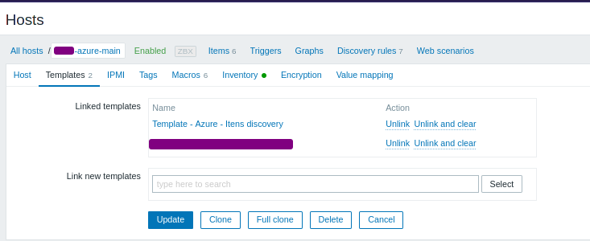

# azure-monitor
A proof-of-concept to get Azure monitor metrics by Python

# How to
You could have a Azure Service principal created and keep yout variables, for example:

```
az ad sp create-for-rbac --name azure-monitor-test
```

Maybe you have more than one subscription and would like to use the same SP for both. So try run the comand as presented below:

``` 
az ad sp create-for-rbac --name logicalis-maas-azure-monitor \
    --role Reader \
    --scopes /subscriptions/<subscription-1> \
        /subscriptions/<subscription-2> \
        /subscriptions/<subscription-3>

```


For additional information or do it by Azure panel, go thru [this link](https://docs.microsoft.com/en-us/azure/active-directory/develop/howto-create-service-principal-portal)

And result will be something like:

```
{
  "appId": "aaaaaa-1234-5c67-0000-abcdefg",
  "displayName": "azure-monitor-test",
  "name": "http://azure-monitor-test",
  "password": "s3cret",
  "tenant": "123az567-89ad-99aa-bbcc1-abvcdfa"
```


Or declare using environment variables:

```
export AZ_TENANT_ID="something"
export AZ_APP_ID="something"
export AZ_APP_PASSWORD="something"
export AZ_SUBSCRIPTION_ID="something"
```

#List AZ Resource Groups
#az group list --output table


# USAGE:

To discover Available Metrics for a Azure product:
```
get_azmonitordata.py -M "name,resource_group_name,type"
```

To get AZ Metric values:
```
get_azmonitordata.py -m "name,resource_group_name,type,metric_name,aggregation"
``` 

_type_: Azure Components granted by this script. :

* AKS: Azure Kubernetes Services
* ADF: Data Factory
* APIM: API Management
* VM: Virtual Machines
* WEB: App WebServices
* SQL: Azure databases
* CONNECTION: Azure connections [app_gateway or vpn_gateway]


_aggregation_ : metric aggregation, depends of metric

* total: Gets all values in a timerange, and sums it.
* average: presents a mean value in the timerange.

SPECIFIC TIMERANGES (default is 5)

Use the  option _-t_ to define a custom time minute range, in minutes. Example:

```
./az_getmonitormetrics.py -m "cclient-aks-prod,resourcegroup_name,AKS,node_disk_usage_bytes,average" -t 10
```


TODO:

* Aggregate others Azure components [in the list](https://docs.microsoft.com/pt-br/azure/azure-monitor/essentials/metrics-supported)
* AKS: Split metrics by nodes (e.g: node memory, presenting each node separated)


### Zabbix Template ###

To use in Zabbix, follow these instructions:

- Copy the files in this repository to external scripts folder (usually /usr/lib/zabbix/externalscripts)
- Install the python libraries with `pip install -r requirements.txt`

In the frontend, include the template _zabbix_template_azure.yaml_ . There will append all Azure templates.


- Create an host and attach the template "Template - Itens Discovery"




- In *Macros*, put in the values your Azure Service Principal credentials:

* AZURE_APP_ID 
* AZURE_APP_PASSWORD
* AZURE_SUBSCRIPTION_ID
* AZURE_TENANT_ID

* *AZURE CLIENT NAME* : This macro exists for Inventory Purposes. The discover will create hosts for each component detected, and add in groups "{$CLIENTNAME} - Azure/ITEM" (E. G.: ClientName - Azure/VirtualMachine) .

### Regarding duplicated names ###

Sometimes, you have hosts with same names, like a database and a virtual machine called "foo". Zabbix doesn'allow duplicated names. 
The way I've found to workaround it was append suffix and prefix on hostnames. So, you'll see hosts with these names:

* sql/foo
* vm/foo

In order to still make sense the names, there's a macro AZURE_xxxx_NAME, where _xxxx_  is the type of item at the macro


### BUY ME A COFFEE ;) 


* [Paypal](https://www.paypal.com/cgi-bin/webscr?cmd=_donations&business=29JLND674CAGY&currency_code=BRL)
